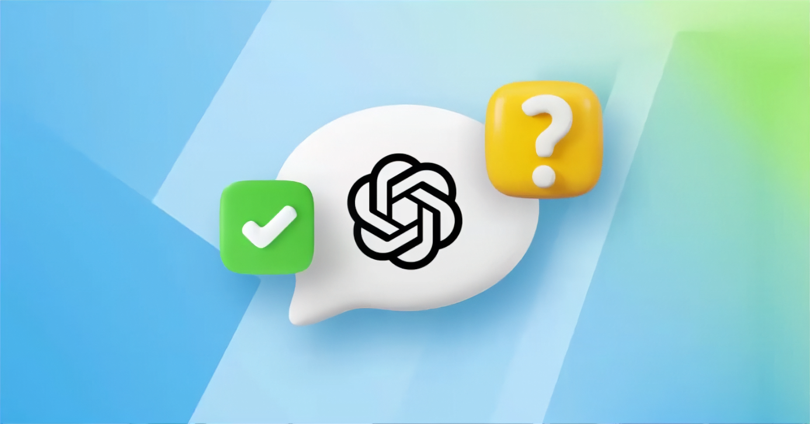

# Telegram ChatGPT Bot

A versatile Telegram bot that integrates with OpenAI's ChatGPT to provide various interactive features.


---

### ✔ Core Features:

- **Random Fact Generator** - Get interesting facts with AI-generated content
- **ChatGPT Interface** - Direct chat with OpenAI's ChatGPT
- **Celebrity Chat** - Chat with AI personalities (Linus Torvalds, Gandalf, etc.)
- **Language Translator** - Translate text to English, Ukrainian, Chinese, Latin, and Klingon
- **Smart Recommendations** - Personalized movie, book, and music suggestions

---


### ✔ Prerequisites

- Python 3.13+
- Telegram Bot Token (from @BotFather)
- OpenAI API Key
- Required Python packages (see `requirements.txt`)

---

### ✔ Installation

Clone the repository:

```
git clone https://github.com/andriy-titov-coder/my_tg_bot_for_me
   cd my_tg_bot_for_me
   ```

2. **Create and activate a virtual environment:**
   ```bash
   python -m venv .venv
   source .venv/bin/activate  # On Windows: .venv\Scripts\activate
   ```

3. **Install dependencies:**
   ```bash
   pip install -r requirements.txt
   ```

4. **Configuration:**
   Create a `.env` file in the project root and add your tokens:
   ```env
   BOT_TOKEN=your_telegram_bot_token
   CHATGPT_TOKEN=your_openai_api_key
   ```

---

### ✔ Usage

**Start the bot:**

```bash
python src/bot.py
```

**Run tests:**

```bash
python -m pytest
```

In Telegram, find your bot using the username you set up and start a chat.

Available commands:

- `/start` - Start the bot
- `/random` - Get a random fact
- `/gpt` - Chat with ChatGPT
- `/talk` - Chat with a celebrity personality
- `/translate` - Translate text to English, Ukrainian, Chinese, Latin, Klingon
- `/recommend` - Get a movie, music or book recommendation



---

### ✔ Project Structure

```
my_tg_bot_for_me
├── .env                 # Environment variables (private)
├── .gitignore           # Git ignore rules
├── pytest.ini           # Pytest configuration
├── README.md            # Project documentation
├── requirements.txt     # Project dependencies
├── src/
│   ├── __init__.py
│   ├── bot.py           # Application entry point
│   ├── config.py        # Config & Env loader
│   ├── gpt.py           # OpenAI API logic
│   ├── handlers.py      # Telegram command handlers
│   ├── utils.py         # Helper functions
│   └── resources/       # Assets (images, prompts, messages)
└── tests/               # Automated tests
    ├── __init__.py
    ├── test_gpt.py      # Tests for GPT service
    └── test_utils.py    # Tests for utility functions

---

### ✔ Environment Variables

The following environment variables need to be set:

- `TELEGRAM_BOT_TOKEN`: Your Telegram Bot Token from @BotFather
- `OPENAI_API_KEY`: Your OpenAI API key

---

### ✔ Contributing

- Fork the repository
- Create a new branch for your feature
- Commit your changes
- Push to the branch
- Create a new Pull Request

---

### ✔ License

This project is licensed under the MIT License - see the [LICENSE](LICENSE) file for details.


---